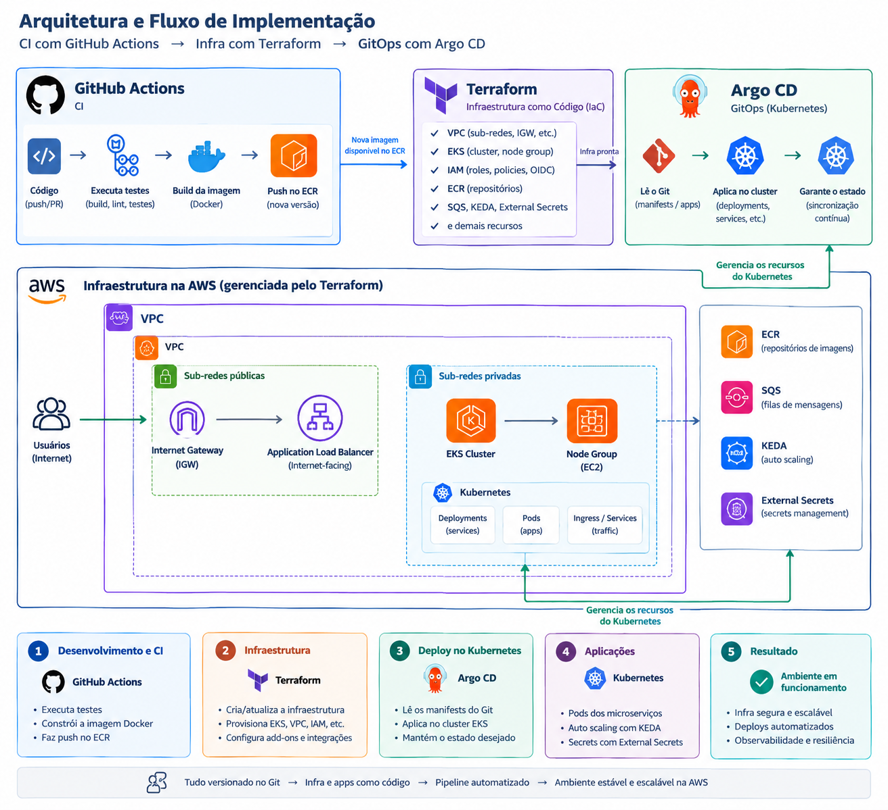

# Toggle Master Microservices - IaC, CI/CD e DevSecOps

## **1. Identificação do Projeto**

- **Projeto:** Toggle Master Microservices
- **Fase:** 03 - IaC, CI/CD e DevSecOps
- **Integrantes:** Grupo 53
  - Arthur de Castilho Nascimento - RM371601 - [castartx@gmail.com](mailto:castartx@gmail.com)
  - Gerusa Fernandes Lobo Nogueira - RM367568 - [gerusalobo@gmail.com](mailto:gerusalobo@gmail.com)
  - José Henrique Cavalcanti de Melo Filho -  RM 372074 - [meloricke.bra@gmail.com](mailto:meloricke.bra@gmail.com)
  - Pedro Vinicius Araujo Negreiros - RM372553 - [pedro28vinicius@hotmail.com](mailto:pedro28vinicius@hotmail.com)

## 2. Objetivo do Projeto

A arquitetura é dividida nos em 5 microsserviços:

auth-service (Go): Gerencia chaves de API e autenticação. (Banco de Dados: PostgreSQL)

flag-service (Python): CRUD das definições das feature flags. (Banco de Dados: PostgreSQL)

targeting-service (Python): Gerencia regras complexas de segmentação. (Banco de Dados: PostgreSQL)

evaluation-service (Go): O "caminho quente" (hot path) de alta performance que retorna a decisão final (true/false). (Cache: Redis)

analytics-service (Python): Consome eventos de uma fila e salva dados de análise. (Fila: AWS SQS, Banco de Dados: AWS DynamoDB)

A missão desse projeto é automatizar toda a infraestrutura e o ciclo de vida dos 5 microsserviços do ToggleMaster (auth, flag, targeting, evaluation, analytics) utilizando as práticas de IaC, CI/CD e DevSecOps.

## 3. Arquitetura

Resumindo:

O Terraform, cria toda a infraestrutura de VPC, Cluster, ECR, além de instalar via Helm o nginx, argoCD, Keda e Métricas. O Terraform também é responsável por criar as roles iam, as secrets no secret manager e  startar o argoCD.

O ArgoCD instalado no Cluster, monitora o repo dos K8s, e caso haja alguma modificação, seja pela atualização da tag da imagem ou ajustes ele reconfigura o nodegroup e os pods.

O código ao ser comitado, a pipelinge do GitHub actions é ativada, o código é testado e caso passe nos testes, a imagem é criada e atualizada no ECR e a tag atualizada no repo dos k8s, para trigger do ArgoCD.

O detalhamento da Implementação de cada parte está no seu readme.md

- O código das aplicações e testes automatizados estão no repositório: https://github.com/castilhoarth/tech-challenge-3-ci-services

- Os Manifestos do K8s estão no repositório: https://github.com/castilhoarth/tech-challenge-3-k8s

- E os Manifestos do Terraform, no repositório: https://github.com/castilhoarth/tech-challenge-3-terraform

## 4. Desafios e Decisões do Projeto

Criação 3 repos separados replicando a boa prática do mercado.

Da mesma forma da fase 2, para minimizar os custos precisamos usar os nodes como t3.micro, que tem uma limitação de até 4 pods por node. Dessa forma o Autoscaler precisou ter:

  desired_size   = 11

  min_size       = 9

  max_size       = 15

Também da mesma forma da fase 2, há uma limitação no free tier para a criação de 2 RDS, dessa forma usamos o RDS do Flag também para o banco do Targeting.

Decidimos Startar o ArgoCD via Terraform de forma a que a aplicação subisse de forma automática junto com a infraestrutura sem necessitar de comandos manuais de apply.

O Local que decidimos armazenar todas as secrets e informações entre aplicações foi a AWS Managed Secrets, de forma a ser centralizado e não exigir armazenamento dentro dos repositórios ou martelados. O **Managed secrets** tem as credenciais dos bancos, assim como o Master Key para o Auth, as urls do sqs e Redis, e a API criada no Auth e utilizada no Evaluation.

Para criação, inicialização e atualização dos bancos, e criação da API_Key do Auth para o Evaluation foram utilizados jobs no argoCD, com a ordem da subida das aplicações e dependencias usando waves gerenciadas pelo Argo.

Por incrementar muito a quantidade de nodes e considerando a limitação de 4 pods por node, decidimos usar **OIDC/IRSA (IAM Roles for Service Accounts)** para as ServiceAccounts que precisam acessar recursos AWS, em vez de adotar o **EKS Pod Identity** com o agente instalado como DaemonSet (um pod por node).

Isso aparece na arquitetura atual, por exemplo, nos módulos:

- **KEDA** → ServiceAccount `keda-operator` → role via OIDC.
- **External Secrets** → ServiceAccount `external-secrets` → role via OIDC.
- **Cluster Autoscaler** → ServiceAccount própria → role via OIDC.
- **Evaluation** → role via OIDC.
- **Analytics** → role via OIDC.

## 5 Testes e Deploy

## 6 Orçamento

## 7 Video de Apresentação

