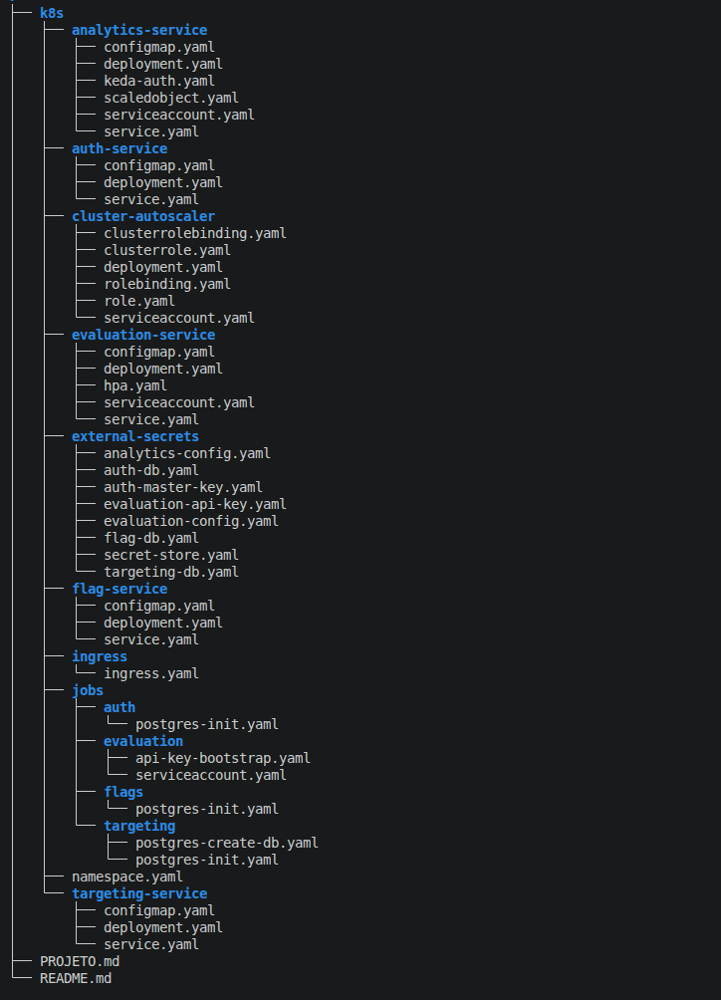

# Toggle Master Microservices - ArgoCD


Este repositório contém a infraestrutura como código (IaC) automatizada para o **ToggleMaster**, uma plataforma de gerenciamento e avaliação de Feature Flags composta por **5 microsserviços**:

1. **Auth Service** — Autenticação e gestão de permissões.
2. **Flag Service** — Gerenciamento e cadastro de feature flags.
3. **Targeting Service** — Regras de direcionamento e segmentação de usuários.
4. **Evaluation Service** — Avaliação em tempo real de flags com baixa latência.
5. **Analytics Service** — Processamento e armazenamento de eventos de telemetria e auditoria.

A infraestrutura é provisionada utilizando **Terraform na AWS**, enquanto o deployment das aplicações Kubernetes é gerenciado através de **Argo CD**, seguindo uma abordagem GitOps.


## Estrutura do Kubernetes

Os manifests Kubernetes são organizados por ambiente e por microsserviço. Cada aplicação possui seus próprios Deployments, Services e configurações, enquanto Jobs são utilizados para tarefas de inicialização e bootstrap. O gerenciamento de segredos é realizado pelo External Secrets Operator, integrando o Kubernetes ao AWS Secrets Manager. O acesso dos componentes aos serviços AWS utiliza IAM Roles associadas às ServiceAccounts através do OIDC do EKS. O KEDA realiza o autoscaling do `analytics-service` com base no backlog da fila SQS. O Argo CD monitora o repositório GitOps e sincroniza os manifests com o cluster EKS, mantendo o estado das aplicações alinhado ao Git.


Cada microsserviço possui seus próprios manifests Kubernetes, mantendo a configuração isolada.

O `Deployment` define os pods e suas imagens, enquanto `Service` fornece a comunicação interna entre os microsserviços.



### Jobs

Os Jobs ficam separados dos Deployments porque possuem uma finalidade diferente: **executar uma tarefa de inicialização uma vez**, e não manter um processo rodando continuamente.

No projeto, eles são utilizados para preparar os bancos e realizar inicializações necessárias, como:

- criação dos databases;
- criação/ajuste das tabelas;
- inicialização de dados;
- bootstrap da API key do Evaluation.

Depois que terminam, ficam com status `Completed`.

### Secrets

Os dados sensíveis não ficam versionados diretamente nos manifests.

A arquitetura utiliza:

```
AWS Secrets Manager
        │
        ▼
External Secrets Operator
        │
        ▼
Kubernetes Secret
        │
        ▼
Deployment
```

O **External Secrets Operator** utiliza uma ServiceAccount associada a uma IAM Role através do **OIDC do EKS**. Assim, o pod não precisa armazenar credenciais AWS.

### KEDA

O `analytics-service` possui um `ScaledObject` que monitora a fila SQS:

```
SQS
 │
 │ mensagens
 ▼
KEDA
 │
 │ métrica externa
 ▼
HPA
 │
 ▼
analytics-service
```

O KEDA aumenta ou reduz as réplicas do Analytics conforme o backlog da fila.

### ServiceAccounts e IAM

Os componentes que precisam acessar serviços AWS utilizam **IAM Roles associadas às ServiceAccounts através do OIDC/IRSA**.

Isso permite que cada componente tenha apenas as permissões necessárias. Por exemplo:

```
SQS
 │
 │ mensagens
 ▼
KEDA
 │
 │ métrica externa
 ▼
HPA
 │
 ▼
analytics-service
```

## Argo CD

O **Argo CD é responsável pelo deploy dos recursos Kubernetes**.

O fluxo fica:

```
GitHub
   │
   ▼
Repositório GitOps
   │
   ▼
Argo CD
   │
   ▼
EKS
   │
   ├── Deployments
   ├── Services
   ├── Jobs
   ├── ConfigMaps
   ├── Secrets / ExternalSecrets
   └── KEDA / HPA
```

Assim, o Git passa a ser a fonte de verdade dos manifests Kubernetes. O Terraform provisiona a infraestrutura necessária e o Argo CD gerencia o estado das aplicações dentro do cluster.

O ArgoCD é instalado e a Aplicação Ativada pelo Terraform.

```
resource "terraform_data" "toggle_prod_application" {

  depends_on = [
    module.helm
  ]

  provisioner "local-exec" {
    command = <<-EOT
      aws eks update-kubeconfig \
        --region ${var.aws_region} \
        --name ${var.cluster_name}

      kubectl apply -f - <<'YAML'
apiVersion: argoproj.io/v1alpha1
kind: Application
metadata:
  name: toggle-prod
  namespace: argocd
spec:
  project: default
  source:
    repoURL: https://github.com/gerusalobo/toggle-master-devops.git
    targetRevision: main
    path: k8s/apps/toggle-prod
    directory:
      recurse: true
  destination:
    server: https://kubernetes.default.svc
    namespace: toggle-prod
  syncPolicy:
    automated:
      prune: true
      selfHeal: true
    syncOptions:
      - CreateNamespace=false
YAML
    EOT
  }
}
```

### Waves

Os recursos Kubernetes utilizam `argocd.argoproj.io/sync-wave` para controlar a ordem de sincronização pelo Argo CD. Recursos com waves menores são processados primeiro, permitindo respeitar as dependências entre configurações, Jobs de inicialização, microsserviços e componentes de autoscaling. Dessa forma, o Argo CD consegue realizar a implantação de forma ordenada e previsível, evitando que um recurso seja iniciado antes de suas dependências estarem disponíveis. As waves controlam exclusivamente a ordem dos recursos Kubernetes; a criação e o ciclo de vida da infraestrutura AWS permanecem sob responsabilidade do Terraform.

As **waves** são importantes na estrutura porque definem **a ordem em que o Argo CD cria os recursos Kubernetes**.

No projeto, usamos a anotação:

```
argocd.argoproj.io/sync-wave: "N"
```

As sync waves ficam exclusivamente no lado do Argo CD, garantindo que os manifests sejam aplicados na ordem necessária. Quanto menor o número da wave, primeiro o recurso é aplicado. O Argo CD aguarda a conclusão/saúde da etapa antes de avançar para a próxima. 


```
Wave 0
  │
  ├── Namespace
  ├── External Secrets dos Bancos e Master Key
  │
  ▼
Wave 1
  │
  ├── Jobs de criação/inicialização dos bancos
  │   └── Tabela do Auth e Flag e Criação do banco do Targeting
  │
  ▼
Wave 2
  │
  ├── Jobs de criação/inicialização dos bancos
  │   └── Tabela do Targeting
  │
  ▼
Wave 3
  │
  ├── Auth Service
  ├── Flag Service
  └── Targeting Service
  └── Ingress
  │
  ▼
Wave 4
  │
  └── Jobs Evaluation Bootstrap
  │
  ▼
Wave 5
  │
  └── External Secrets
  │   └── Evaluation config e API Key
  │   └── Analytics Config
  │
  ▼
Wave 6
  │
  └── Evaluation Service
  │
  ▼
Wave 7
  │
  └── Analytics Service
  └── Evaluations HPA
  │
  ▼
Wave 8
  │
  └── KEDA / ScaledObjects
```

## Pré-Requitos e Deployment

Esse projeto faz parte de um projeto maior.

https://github.com/stars/castilhoarth/lists/tech-challenge-3/

Ajustes Necessários para implementação:

Atualização dos Arn das politicas de IAM das services accounts para a instancia AWS correta. Os demais itens são atualziados automaticamente.

Recomendamos usar os 3 projetos em conjunto.

- O ArgoCD é ativado e instalado pelo Terraform.
- Os recursos do Kubernets são atualizados e realizado o deploy automaticamente pelo ArgoCD.

- O GitHub Actions faz o deploy das imagens no ECR e atualiza o link no repo do k8s.

